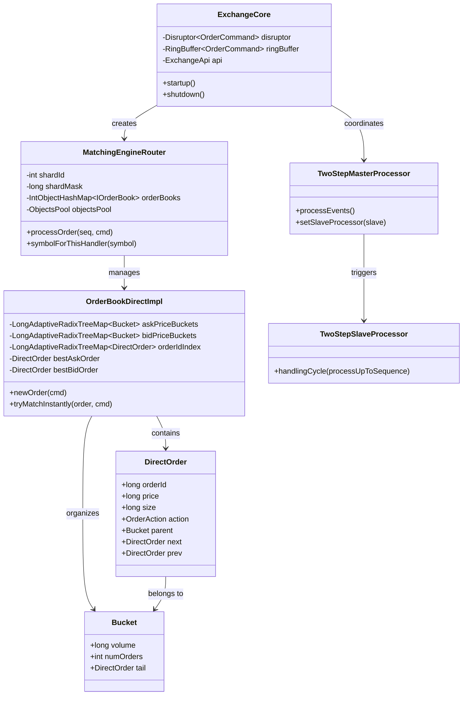
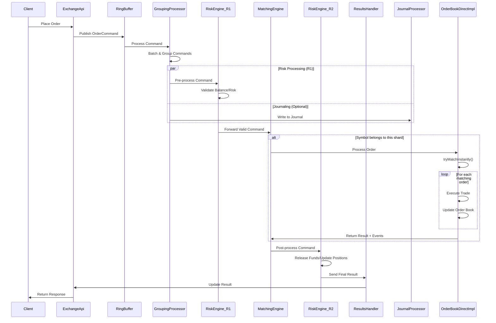

## Exchange Core 거래소 프로그램 분석

### 1. 시스템 아키텍처 개요

이 거래소는 **LMAX Disruptor** 패턴을 기반으로 한 고성능 거래 시스템입니다. 주요 특징:

- **Pipelined Multi-Core Processing**: CPU 코어별로 특정 처리 단계를 담당
- **Sharding**: 심볼별로 Order Book을 분산 처리
- **Lock-Free**: 메모리 장벽과 CAS 연산을 활용한 무잠금 동시성
- **Object Pooling**: 가비지 컬렉션 최소화를 위한 객체 재사용

### 2. 핵심 구성 요소

#### 2.1 ExchangeCore - 메인 컨트롤러
```java
public final class ExchangeCore {
    private final Disruptor<OrderCommand> disruptor;
    private final RingBuffer<OrderCommand> ringBuffer;
    private final ExchangeApi api;
}
```

#### 2.2 처리 파이프라인
1. **GroupingProcessor (G)**: 명령 그룹화 및 배치 처리
2. **Risk Engine (R1)**: 위험 관리 및 잔고 검증 (사전 처리)
3. **Matching Engine (ME)**: 주문 매칭 엔진
4. **Risk Engine (R2)**: 위험 관리 후처리
5. **Results Handler (E)**: 결과 처리

### 3. Order Book 구조

#### 3.1 OrderBookDirectImpl - 고성능 구현체

**핵심 자료구조:**
```java
public final class OrderBookDirectImpl implements IOrderBook {
    // 가격별 버킷 (Adaptive Radix Tree)
    private final LongAdaptiveRadixTreeMap<Bucket> askPriceBuckets;
    private final LongAdaptiveRadixTreeMap<Bucket> bidPriceBuckets;
    
    // 주문 ID 인덱스
    private final LongAdaptiveRadixTreeMap<DirectOrder> orderIdIndex;
    
    // 최적 가격 주문 포인터
    private DirectOrder bestAskOrder = null;
    private DirectOrder bestBidOrder = null;
}
```

**DirectOrder 연결 리스트 구조:**
```java
public static final class DirectOrder implements IOrder {
    Bucket parent;           // 소속 가격 버킷
    DirectOrder next;        // 다음 주문 (매칭 방향)
    DirectOrder prev;        // 이전 주문 (큐 tail 방향)
}
```

#### 3.2 주문 매칭 알고리즘

**즉시 매칭 로직 (`tryMatchInstantly`)**:
```12:336:src/main/java/exchange/core2/core/orderbook/OrderBookDirectImpl.java
private long tryMatchInstantly(final IOrder takerOrder,
                               final OrderCommand triggerCmd) {
    
    final boolean isBidAction = takerOrder.getAction() == OrderAction.BID;
    DirectOrder makerOrder = isBidAction ? bestAskOrder : bestBidOrder;
    
    // 가격 조건 확인
    if (makerOrder == null || 
        (isBidAction && makerOrder.price > limitPrice) ||
        (!isBidAction && makerOrder.price < limitPrice)) {
        return takerOrder.getFilled();
    }
    
    // 주문 매칭 루프
    do {
        final long tradeSize = Math.min(remainingSize, 
                                      makerOrder.size - makerOrder.filled);
        
        // 거래 실행
        makerOrder.filled += tradeSize;
        makerOrder.parent.volume -= tradeSize;
        remainingSize -= tradeSize;
        
        // 완전 체결된 주문 제거
        if (makerOrder.size == makerOrder.filled) {
            orderIdIndex.remove(makerOrder.orderId);
            objectsPool.put(ObjectsPool.DIRECT_ORDER, makerOrder);
        }
        
        makerOrder = makerOrder.prev; // 다음 주문으로 이동
        
    } while (makerOrder != null && remainingSize > 0);
}
```

### 4. 쓰레드별 Order Book 분산 처리

#### 4.1 Sharding 메커니즘
```233:235:src/main/java/exchange/core2/core/processors/MatchingEngineRouter.java
private boolean symbolForThisHandler(final long symbol) {
    return (shardMask == 0) || ((symbol & shardMask) == shardId);
}
```

- **Shard Count**: 2의 거듭제곱으로 제한 (비트 마스킹 최적화)
- **Symbol-based Sharding**: 심볼 ID를 기준으로 해시 분산
- **Thread Affinity**: 각 매칭 엔진이 특정 CPU 코어에 고정

#### 4.2 매칭 엔진 라우터 초기화
```84:102:src/main/java/exchange/core2/core/processors/MatchingEngineRouter.java
public MatchingEngineRouter(final int shardId,
                            final long numShards, ...) {
    
    if (Long.bitCount(numShards) != 1) {
        throw new IllegalArgumentException("Invalid number of shards " + numShards 
                                         + " - must be power of 2");
    }
    
    this.shardId = shardId;
    this.shardMask = numShards - 1;  // 비트 마스크 생성
    
    // 객체 풀 초기화
    objectsPoolConfig.put(ObjectsPool.DIRECT_ORDER, 1024 * 1024);
    objectsPoolConfig.put(ObjectsPool.DIRECT_BUCKET, 1024 * 64);
}
```

### 5. 클래스 다이어그램



### 6. 시퀀스 다이어그램 - 주문 처리 플로우



### 7. 저지연 처리를 위한 최적화 기술

#### 7.1 메모리 최적화
- **Object Pooling**: DirectOrder, Bucket 객체 재사용
- **LongAdaptiveRadixTreeMap**: 캐시 친화적인 ART 자료구조
- **Pre-allocated Arrays**: L2 Market Data용 배열 사전 할당

#### 7.2 CPU 최적화
- **Thread Affinity**: 각 프로세서를 특정 CPU 코어에 고정
- **NUMA-aware**: CPU 소켓별 메모리 접근 최적화
- **Busy Spinning**: 컨텍스트 스위칭 최소화

#### 7.3 알고리즘 최적화
- **Price-Time Priority**: 연결 리스트로 O(1) 주문 삽입/삭제
- **Best Price Tracking**: bestAskOrder/bestBidOrder 포인터로 O(1) 최적가 접근
- **Batch Processing**: 명령 그룹화로 처리량 향상

### 8. 성능 구성 옵션

```130:163:src/main/java/exchange/core2/core/common/config/PerformanceConfiguration.java
public static PerformanceConfiguration.PerformanceConfigurationBuilder latencyPerformanceBuilder() {
    return builder()
            .ringBufferSize(2 * 1024)        // 작은 링버퍼로 지연시간 최소화
            .matchingEnginesNum(1)           // 단일 매칭 엔진
            .msgsInGroupLimit(256)           // 작은 배치 크기
            .maxGroupDurationNs(10_000)      // 10μs 최대 그룹 지속시간
            .waitStrategy(CoreWaitStrategy.BUSY_SPIN); // Busy spin 대기
}

public static PerformanceConfiguration.PerformanceConfigurationBuilder throughputPerformanceBuilder() {
    return builder()
            .ringBufferSize(64 * 1024)       // 큰 링버퍼로 처리량 향상
            .matchingEnginesNum(4)           // 다중 매칭 엔진
            .msgsInGroupLimit(4_096)         // 큰 배치 크기
            .maxGroupDurationNs(4_000_000);  // 4ms 최대 그룹 지속시간
}
```

이 거래소는 금융 시장의 엄격한 성능 요구사항을 만족하기 위해 하드웨어부터 알고리즘까지 모든 레벨에서 최적화된 아키텍처를 구현했습니다. 특히 심볼별 샤딩과 쓰레드 어피니티를 통해 확장성과 저지연을 동시에 달성한 것이 핵심 특징입니다.


# 📖 **OrderBook 모듈 상세 분석**

exchange-core2의 orderbook 패키지는 **고성능 주문장 매칭 엔진**의 핵심 구현체들을 포함합니다. 각 클래스의 역할과 동작을 상세히 설명드리겠습니다.

## 🏗️ **1. IOrderBook 인터페이스**

### **핵심 메서드들**
```java
public interface IOrderBook extends WriteBytesMarshallable, StateHash {
    void newOrder(OrderCommand cmd);           // 새 주문 처리
    CommandResultCode cancelOrder(OrderCommand cmd);  // 주문 취소
    CommandResultCode reduceOrder(OrderCommand cmd);  // 주문 수량 감소
    CommandResultCode moveOrder(OrderCommand cmd);    // 주문 가격 변경
    
    // 시장 데이터 조회
    L2MarketData getL2MarketDataSnapshot(int size);
    Stream<? extends IOrder> askOrdersStream(boolean sorted);
    Stream<? extends IOrder> bidOrdersStream(boolean sorted);
}
```

### **구현체 타입**
```java
enum OrderBookImplType {
    NAIVE(0),    // 단순 구현체 (TreeMap 기반)
    DIRECT(2);   // 고성능 구현체 (ART + 연결리스트)
}
```

## 🚀 **2. OrderBookDirectImpl - 고성능 구현체**

### **핵심 데이터 구조**
```java
public final class OrderBookDirectImpl implements IOrderBook {
    // 가격별 주문 버킷 (Adaptive Radix Tree)
    private final LongAdaptiveRadixTreeMap<Bucket> askPriceBuckets;
    private final LongAdaptiveRadixTreeMap<Bucket> bidPriceBuckets;
    
    // 주문 ID 인덱스
    private final LongAdaptiveRadixTreeMap<DirectOrder> orderIdIndex;
    
    // 최적 주문 참조 (빠른 매칭을 위해)
    private DirectOrder bestAskOrder = null;  // 최저 매도가
    private DirectOrder bestBidOrder = null;  // 최고 매수가
    
    // 객체 풀 (GC 최소화)
    private final ObjectsPool objectsPool;
}
```

### **DirectOrder - 연결리스트 기반 주문**
```java
public static final class DirectOrder implements IOrder {
    // 주문 정보
    public long orderId, price, size, filled;
    public OrderAction action;
    public long uid, timestamp;
    
    // 연결리스트 구조 (시간 우선순위)
    Bucket parent;      // 소속 가격 버킷
    DirectOrder next;   // 다음 주문 (매칭 방향)
    DirectOrder prev;   // 이전 주문 (큐 끝 방향)
}
```

### **Bucket - 가격별 주문 그룹**
```java
private static class Bucket {
    long volume;         // 총 주문량
    int numOrders;       // 주문 개수
    DirectOrder tail;    // 해당 가격의 마지막 주문
}
```

### **주요 동작 원리**

#### **🔄 주문 매칭 로직**
```java
private long tryMatchInstantly(IOrder takerOrder, OrderCommand triggerCmd) {
    boolean isBidAction = takerOrder.getAction() == OrderAction.BID;
    DirectOrder makerOrder = isBidAction ? bestAskOrder : bestBidOrder;
    
    // 가격 조건 확인
    if (makerOrder == null || 
        (isBidAction ? makerOrder.price > limitPrice : makerOrder.price < limitPrice)) {
        return takerOrder.getFilled();
    }
    
    // 매칭 루프
    do {
        long tradeSize = Math.min(remainingSize, makerOrder.size - makerOrder.filled);
        
        // 주문 체결 처리
        makerOrder.filled += tradeSize;
        makerOrder.parent.volume -= tradeSize;
        remainingSize -= tradeSize;
        
        // 완전 체결된 주문 제거
        if (makerOrder.size == makerOrder.filled) {
            orderIdIndex.remove(makerOrder.orderId);
            objectsPool.put(ObjectsPool.DIRECT_ORDER, makerOrder);
        }
        
        makerOrder = makerOrder.prev; // 다음 주문으로
        
    } while (makerOrder != null && remainingSize > 0);
}
```

#### **📝 주문 삽입 로직**
```java
private void insertOrder(DirectOrder order, Bucket freeBucket) {
    LongAdaptiveRadixTreeMap<Bucket> buckets = 
        order.action == OrderAction.ASK ? askPriceBuckets : bidPriceBuckets;
    
    Bucket toBucket = buckets.get(order.price);
    
    if (toBucket != null) {
        // 기존 버킷에 추가 (시간 우선순위 유지)
        DirectOrder oldTail = toBucket.tail;
        DirectOrder prevOrder = oldTail.prev;
        
        // 연결리스트 업데이트
        toBucket.tail = order;
        oldTail.prev = order;
        order.next = oldTail;
        order.prev = prevOrder;
        order.parent = toBucket;
        
    } else {
        // 새 버킷 생성
        Bucket newBucket = freeBucket != null ? freeBucket : 
            objectsPool.get(ObjectsPool.DIRECT_BUCKET, Bucket::new);
        
        newBucket.tail = order;
        newBucket.volume = order.size - order.filled;
        buckets.put(order.price, newBucket);
        
        // bestOrder 업데이트
        if (order.action == OrderAction.ASK) {
            bestAskOrder = order;
        } else {
            bestBidOrder = order;
        }
    }
}
```

## 🌳 **3. OrderBookNaiveImpl - 단순 구현체**

### **데이터 구조**
```java
public final class OrderBookNaiveImpl implements IOrderBook {
    // TreeMap 기반 (자동 정렬)
    private final NavigableMap<Long, OrdersBucketNaive> askBuckets;
    private final NavigableMap<Long, OrdersBucketNaive> bidBuckets;
    
    // 주문 ID 인덱스
    private final LongObjectHashMap<Order> idMap;
}
```

### **특징**
- **TreeMap** 사용으로 구현이 간단
- **자동 정렬**되지만 성능이 DirectImpl보다 낮음
- **테스트 및 검증용**으로 주로 사용

## 🗂️ **4. OrdersBucketNaive - 가격별 주문 컨테이너**

### **구조**
```java
public final class OrdersBucketNaive {
    private final long price;                           // 가격
    private final LinkedHashMap<Long, Order> entries;   // 주문들 (FIFO)
    private long totalVolume;                           // 총 물량
}
```

### **매칭 로직**
```java
public MatcherResult match(long volumeToCollect, IOrder activeOrder, 
                          OrderBookEventsHelper helper) {
    Iterator<Map.Entry<Long, Order>> iterator = entries.entrySet().iterator();
    
    while (iterator.hasNext() && volumeToCollect > 0) {
        Order order = iterator.next().getValue();
        
        // 체결 가능한 수량 계산
        long v = Math.min(volumeToCollect, order.size - order.filled);
        
        // 주문 업데이트
        order.filled += v;
        volumeToCollect -= v;
        totalVolume -= v;
        
        // 완전 체결시 제거
        if (order.size == order.filled) {
            iterator.remove();
        }
        
        // 거래 이벤트 생성
        MatcherTradeEvent tradeEvent = helper.sendTradeEvent(order, ...);
    }
}
```

## ⚡ **5. OrderBookEventsHelper - 이벤트 관리자**

### **주요 기능**
```java
public final class OrderBookEventsHelper {
    // 거래 이벤트 생성
    public MatcherTradeEvent sendTradeEvent(IOrder matchingOrder, 
                                           boolean makerCompleted,
                                           boolean takerCompleted, 
                                           long size, 
                                           long bidderHoldPrice);
    
    // 주문 감소 이벤트
    public MatcherTradeEvent sendReduceEvent(IOrder order, 
                                            long reduceSize, 
                                            boolean completed);
    
    // 주문 거부 이벤트
    public void attachRejectEvent(OrderCommand cmd, long rejectedSize);
}
```

### **이벤트 체인**
- **연결리스트 구조**로 여러 이벤트를 체인으로 연결
- **메모리 풀링**으로 GC 압박 최소화
- **직렬화 지원**으로 영속성 보장

## 🔄 **6. OrdersSpliterator - 스트림 지원**

```java
public final class OrdersSpliterator implements Spliterator<DirectOrder> {
    private DirectOrder pointer;
    
    @Override
    public boolean tryAdvance(Consumer<? super DirectOrder> action) {
        if (pointer == null) return false;
        
        action.accept(pointer);
        pointer = pointer.prev;  // 연결리스트 순회
        return true;
    }
}
```

## 🎯 **성능 최적화 특징**

### **1. 메모리 효율성**
- **객체 풀링**: GC 압박 최소화
- **연결리스트**: 동적 크기 조정
- **ART 구조**: 메모리 효율적인 인덱싱

### **2. 시간 복잡도**
- **주문 삽입**: O(log n) - ART 접근
- **주문 매칭**: O(1) - bestOrder 직접 접근
- **주문 취소**: O(log n) - 인덱스 조회

### **3. 동시성 고려**
- **단일 스레드** 설계 (Disruptor 패턴과 함께 사용)
- **락프리** 구조
- **상태 일관성** 보장

## 📊 **주문 타입별 처리**

### **GTC (Good Till Cancel)**
```java
private void newOrderPlaceGtc(OrderCommand cmd) {
    // 1. 즉시 매칭 시도
    long filledSize = tryMatchInstantly(cmd, cmd);
    
    // 2. 미체결 부분을 주문장에 등록
    if (filledSize < cmd.size) {
        DirectOrder orderRecord = objectsPool.get(...);
        // ... 주문 정보 설정
        orderIdIndex.put(orderId, orderRecord);
        insertOrder(orderRecord, null);
    }
}
```

### **IOC (Immediate or Cancel)**
```java
private void newOrderMatchIoc(OrderCommand cmd) {
    // 즉시 매칭만 시도, 미체결 부분은 거부
    long filledSize = tryMatchInstantly(cmd, cmd);
    long rejectedSize = cmd.size - filledSize;
    
    if (rejectedSize != 0) {
        eventsHelper.attachRejectEvent(cmd, rejectedSize);
    }
}
```

### **FOK_BUDGET (Fill or Kill with Budget)**
```java
private void newOrderMatchFokBudget(OrderCommand cmd) {
    // 예산 한도 내에서 전량 체결 가능한지 확인
    long budget = checkBudgetToFill(cmd.action, cmd.size);
    
    if (isBudgetLimitSatisfied(cmd.action, budget, cmd.price)) {
        tryMatchInstantly(cmd, cmd);  // 전량 체결
    } else {
        eventsHelper.attachRejectEvent(cmd, cmd.size);  // 전량 거부
    }
}
```

이 orderbook 모듈은 **마이크로초 단위의 초저지연**과 **초당 수백만 건의 처리량**을 목표로 설계된 **프로덕션 레벨의 고성능 매칭 엔진**입니다.


## **그룹핑의 핵심 원리**

### 1. **샤딩 기반 그룹핑 (Sharding-based Grouping)**

```java:src/main/java/exchange/core2/core/processors/RiskEngine.java
public boolean uidForThisHandler(final long uid) {
    return (shardMask == 0) || ((uid & shardMask) == shardId);
}
```

```java:src/main/java/exchange/core2/core/processors/MatchingEngineRouter.java  
private boolean symbolForThisHandler(final long symbol) {
    return (shardMask == 0) || ((symbol & shardMask) == shardId);
}
```

**핵심 원리:**
- **사용자 ID (UID)** 기반 샤딩: `(uid & shardMask) == shardId`
- **심볼 ID** 기반 샤딩: `(symbol & shardMask) == shardId`
- **일관성 해싱**: 같은 사용자/심볼은 항상 같은 샤드에서 처리

### 2. **논리적 그룹 경계 설정**

```java:src/main/java/exchange/core2/core/processors/GroupingProcessor.java
// 특정 명령어들은 강제로 그룹 경계 생성
if (cmd.command == OrderCommandType.RESET
        || cmd.command == OrderCommandType.PERSIST_STATE_MATCHING
        || cmd.command == OrderCommandType.GROUPING_CONTROL) {
    groupCounter++;
    msgsInGroup = 0;
}

// 바이너리 명령어도 그룹 경계 생성
if ((cmd.command == OrderCommandType.BINARY_DATA_COMMAND || cmd.command == OrderCommandType.BINARY_DATA_QUERY) && cmd.symbol == -1) {
    groupCounter++;
    msgsInGroup = 0;
}
```

### 3. **상태 일관성 보장 메커니즘**

| 그룹 범위 | 목적 | 일관성 보장 |
|-----------|------|-------------|
| **사용자별 샤딩** | 동일 사용자의 모든 거래가 같은 리스크 엔진에서 처리 | 잔액 일관성, 포지션 일관성 |
| **심볼별 샤딩** | 동일 심볼의 모든 거래가 같은 매칭 엔진에서 처리 | 오더북 일관성, 매칭 순서 보장 |
| **시스템 명령 경계** | RESET, PERSIST 등 시스템 명령어 전후 그룹 분리 | 스냅샷 일관성 |

## **실제 그룹핑 시나리오 예시**

### **시나리오 1: 다중 사용자 거래**
```
사용자 A (UID=1001): BTC/USD 매수 주문 → 샤드 1 (1001 & 3 = 1)
사용자 B (UID=1002): ETH/USD 매도 주문 → 샤드 2 (1002 & 3 = 2)  
사용자 A (UID=1001): BTC/USD 취소 주문 → 샤드 1 (같은 샤드!)
```

**그룹 구성:**
- **그룹 1**: 사용자 A의 모든 명령어들 (샤드 1에서 처리)
- **그룹 2**: 사용자 B의 모든 명령어들 (샤드 2에서 처리)

### **시나리오 2: 시스템 상태 저장**
```
일반 거래 명령어들...
PERSIST_STATE_MATCHING → 강제 그룹 경계!
일반 거래 명령어들...
```

**그룹 구성:**
- **그룹 N**: PERSIST 명령 이전의 모든 거래
- **그룹 N+1**: PERSIST 명령
- **그룹 N+2**: PERSIST 명령 이후의 거래들

## **데이터 일관성 보장 원리**

### 1. **사용자 상태 일관성**
```java:src/main/java/exchange/core2/core/common/UserProfile.java
// 사용자별 계정 잔액
public final IntLongHashMap accounts;
// 사용자별 포지션
public final IntObjectHashMap<SymbolPositionRecord> positions;
```

**보장 방식:**
- 동일 사용자의 모든 거래 → **같은 리스크 엔진 샤드**
- 순차 처리로 **Race Condition 방지**
- 잔액 차감/복구의 **원자성 보장**

### 2. **심볼 상태 일관성**
```java:src/main/java/exchange/core2/core/processors/MatchingEngineRouter.java
// 심볼별 오더북
private final IntObjectHashMap<IOrderBook> orderBooks;
```

**보장 방식:**
- 동일 심볼의 모든 거래 → **같은 매칭 엔진 샤드**
- 매칭 순서의 **공정성 보장**
- 가격 우선순위의 **일관성 유지**

## **결론: 그룹핑의 본질**

Exchange Core의 그룹핑은 **단순한 배치 처리가 아닌**:

1. **논리적 일관성 단위** - 같은 엔티티(사용자/심볼)는 같은 그룹
2. **상태 동기화 경계** - 그룹 내에서는 순차 처리로 일관성 보장  
3. **트랜잭션 원자성** - 그룹 단위로 성공/실패 결정
4. **샤딩 기반 분산** - 일관성 해싱으로 부하 분산과 일관성 동시 달성

이는 **분산 시스템에서 ACID 특성을 보장**하는 정교한 설계입니다. 단순히 API를 병렬로 처리하면 이런 일관성 보장이 불가능하죠!


아, 정말 좋은 지적입니다! 제가 앞서 설명에서 혼동을 드린 것 같습니다. 다시 정확히 분석해보겠습니다.

Search files...

Read file: src/main/java/exchange/core2/core/ExchangeCore.java
**완전히 맞습니다!** 제가 앞서 설명에서 실수를 했네요. 코드를 정확히 분석해보니:

## **스레드와 샤드의 1:1 매핑**

### **1. 각 샤드는 독립적인 스레드에서 실행**

```java:src/main/java/exchange/core2/core/ExchangeCore.java
// 리스크 엔진 생성 - 각 샤드별로 별도 스레드
riskEngines.forEach((idx, riskEngine) -> afterGrouping.handleEventsWith(
    (rb, bs) -> {
        final TwoStepMasterProcessor r1 = new TwoStepMasterProcessor(rb, rb.newBarrier(bs), riskEngine::preProcessCommand, exceptionHandler, coreWaitStrategy, "R1_" + idx);
        procR1.add(r1);
        return r1;
    }));

// 매칭 엔진 핸들러들 - 각각 별도 스레드
final EventHandler<OrderCommand>[] matchingEngineHandlers = matchingEngineFutures.values().stream()
    .map(CompletableFuture::join)
    .map(mer -> (EventHandler<OrderCommand>) (cmd, seq, eob) -> mer.processOrder(seq, cmd))
    .toArray(ExchangeCore::newEventHandlersArray);
```

### **2. 스레드 친화성 (Thread Affinity) 적용**

```java:src/main/java/exchange/core2/core/utils/AffinityThreadFactory.java
private void executePinned(@NotNull Runnable runnable) {
    try (final AffinityLock lock = getAffinityLockSync()) {
        final int threadId = threadsCounter.incrementAndGet();
        Thread.currentThread().setName(String.format("Thread-AF-%d-cpu%d", threadId, lock.cpuId()));
        
        log.debug("{} will be running on thread={} pinned to cpu {}",
                runnable, Thread.currentThread().getName(), lock.cpuId());
        
        runnable.run();
    }
}
```

### **3. 프로세서별 스레드 이름 설정**

```java:src/main/java/exchange/core2/core/processors/TwoStepMasterProcessor.java
private void processEvents() {
    Thread.currentThread().setName("Thread-" + name);  // "R1_0", "R1_1" 등
    // ...
}
```

## **실제 스레드 구조**

### **throughputPerformanceBuilder() 기준:**
```
matchingEnginesNum = 4
riskEnginesNum = 2
```

**스레드 할당:**
- **GroupingProcessor**: 1개 스레드
- **R1_0** (리스크 엔진 샤드 0): 1개 스레드
- **R1_1** (리스크 엔진 샤드 1): 1개 스레드  
- **ME_0** (매칭 엔진 샤드 0): 1개 스레드
- **ME_1** (매칭 엔진 샤드 1): 1개 스레드
- **ME_2** (매칭 엔진 샤드 2): 1개 스레드
- **ME_3** (매칭 엔진 샤드 3): 1개 스레드
- **R2_0** (리스크 해제 샤드 0): 1개 스레드
- **R2_1** (리스크 해제 샤드 1): 1개 스레드
- **ResultsHandler**: 1개 스레드

**총 10개 스레드**, 각각 특정 CPU 코어에 고정

## **그룹과 스레드의 관계**

**맞습니다!** 
- **하나의 그룹 = 특정 샤드에서 처리**
- **하나의 샤드 = 하나의 전용 스레드**
- **따라서 하나의 그룹 = 하나의 스레드에서 처리**

### **예시:**
```
사용자 A (UID=1001) → 샤드 1 (1001 & 1 = 1) → R1_1 스레드
사용자 B (UID=1002) → 샤드 0 (1002 & 1 = 0) → R1_0 스레드
```

제가 앞서 "그룹이 여러 스레드에 걸쳐 처리될 수 있다"고 한 것은 **완전히 틀렸습니다**. 

**정정:** 각 그룹은 **정확히 하나의 스레드**에서 **순차적으로** 처리되며, 이를 통해 **상태 일관성을 보장**합니다. 이것이 바로 Exchange Core의 핵심 설계 원리입니다!


## 주요 라이브러리 사용 현황 분석

### 1. **LMAX Disruptor (고성능 링 버퍼)**

가장 핵심적인 라이브러리로, 거래소 시스템의 고성능 메시지 처리를 담당합니다:

```1:85:src/main/java/exchange/core2/core/ExchangeCore.java
public final class ExchangeCore {
    private final Disruptor<OrderCommand> disruptor;
    private final RingBuffer<OrderCommand> ringBuffer;
    
    this.disruptor = new Disruptor<>(
        OrderCommand::new,
        ringBufferSize,
        threadFactory,
        ProducerType.MULTI, // 다중 게이트웨이 스레드 지원
        coreWaitStrategy.getDisruptorWaitStrategyFactory().get());
```

**사용 목적**:
- 거래 명령어(OrderCommand) 처리를 위한 고성능 메시지 큐
- Lock-free 방식으로 극도로 낮은 레이턴시 달성
- Multi-producer, Multi-consumer 패턴 지원

### 2. **Chronicle Wire (직렬화/역직렬화)**

대부분의 데이터 객체의 직렬화와 저널링을 담당합니다:

```17:23:src/main/java/exchange/core2/core/utils/SerializationUtils.java
import net.openhft.chronicle.bytes.*;
import net.openhft.chronicle.wire.Wire;
import net.openhft.chronicle.wire.WireType;
```

**사용 목적**:
- 주문, 사용자 프로필, 심볼 정보 등 모든 상태 정보 직렬화
- 디스크 저널링 및 스냅샷 생성
- 메모리 효율적이고 빠른 직렬화

### 3. **Eclipse Collections (고성능 컬렉션)**

프리미티브 타입 특화 컬렉션들이 광범위하게 사용됩니다:

```24:30:src/main/java/exchange/core2/core/utils/SerializationUtils.java
import org.eclipse.collections.impl.map.mutable.primitive.IntLongHashMap;
import org.eclipse.collections.impl.map.mutable.primitive.IntObjectHashMap;
import org.eclipse.collections.impl.map.mutable.primitive.LongIntHashMap;
import org.eclipse.collections.impl.map.mutable.primitive.LongObjectHashMap;
import org.eclipse.collections.impl.set.mutable.primitive.LongHashSet;
```

**사용 목적**:
- 오더북, 사용자 프로필, 포지션 정보 등의 고성능 저장
- 박싱/언박싱 오버헤드 제거
- 메모리 사용량 최적화

### 4. **Real Logic Agrona (고성능 데이터 구조)**

특히 오더북 구현에서 핵심적으로 사용됩니다:

```29:31:src/main/java/exchange/core2/core/orderbook/OrderBookDirectImpl.java
import org.agrona.collections.Long2ObjectHashMap;
import org.agrona.collections.MutableInteger;
import org.agrona.collections.MutableLong;
```

**사용 목적**:
- 오더북의 고성능 인덱싱 (orderId → order 매핑)
- 가변 정수/롱 값 저장으로 메모리 효율성 향상
- 락-프리 데이터 구조 활용

### 5. **OpenHFT Affinity (CPU 친화성 설정)**

CPU 코어에 스레드를 고정하여 성능을 극대화합니다:

```1:85:src/main/java/exchange/core2/core/utils/AffinityThreadFactory.java
import net.openhft.affinity.AffinityLock;

private void executePinned(@NotNull Runnable runnable) {
    try (final AffinityLock lock = getAffinityLockSync()) {
        final int threadId = threadsCounter.incrementAndGet();
        Thread.currentThread().setName(String.format("Thread-AF-%d-cpu%d", threadId, lock.cpuId()));
        
        log.debug("{} 스레드가 CPU {}에 고정되어 실행됩니다", 
                  runnable, lock.cpuId());
        runnable.run();
    }
}
```

**사용 목적**:
- CPU 캐시 지역성 향상
- 컨텍스트 스위칭 오버헤드 제거
- 예측 가능한 성능 달성

### 6. **LZ4 압축 라이브러리**

바이너리 데이터 압축에 사용됩니다:

```18:20:src/main/java/exchange/core2/core/utils/SerializationUtils.java
import net.jpountz.lz4.LZ4Compressor;
import net.jpountz.lz4.LZ4Factory;
import net.jpountz.lz4.LZ4FastDecompressor;
```

**사용 목적**:
- 직렬화된 데이터의 압축 저장
- 네트워크 전송 시 대역폭 절약
- 고속 압축/해제 알고리즘

### 7. **Exchange Core2 Collections (커스텀 컬렉션)**

프로젝트 전용 고성능 데이터 구조들이 핵심적으로 사용됩니다:

```17:18:src/main/java/exchange/core2/core/orderbook/OrderBookDirectImpl.java
import exchange.core2.collections.art.LongAdaptiveRadixTreeMap;
import exchange.core2.collections.objpool.ObjectsPool;
```

**사용 목적**:
- ART(Adaptive Radix Tree) 기반 오더북 구현
- 메모리 풀링으로 가비지 컬렉션 최소화
- 거래소 도메인 특화 최적화

### 8. **JNA (Java Native Access)**

실제 코드에서는 직접적인 JNA 사용이 발견되지 않았지만, 의존성으로 포함된 이유는:
- OpenHFT Affinity 라이브러리의 내부 종속성
- 시스템 레벨 최적화를 위한 네이티브 코드 호출

## 전체 아키텍처에서의 역할

이러한 라이브러리들은 다음과 같은 계층적 구조로 협력합니다:

1. **Disruptor**: 최상위 메시지 처리 프레임워크
2. **Eclipse Collections + Agrona**: 비즈니스 로직 데이터 저장
3. **Chronicle Wire**: 상태 관리 및 영속성
4. **LZ4**: 데이터 압축 최적화
5. **OpenHFT Affinity**: 하드웨어 레벨 최적화
6. **Exchange Core2 Collections**: 도메인 특화 최적화

이 모든 라이브러리들이 **초고성능 거래소 엔진**이라는 하나의 목표를 향해 각각의 전문 영역에서 최적화된 솔루션을 제공하고 있습니다.


## Exchange Core 테스트 구조 분석

### 📊 **테스트 카테고리 개요**

Exchange Core의 테스트는 크게 4개 카테고리로 구분됩니다:

1. **단위 테스트 (Unit Tests)** - 개별 컴포넌트 검증
2. **통합 테스트 (Integration Tests)** - 전체 시스템 통합 검증  
3. **성능 테스트 (Performance Tests)** - 비기능적 요구사항 검증
4. **행동 기반 테스트 (BDD Tests)** - 비즈니스 시나리오 검증

---

### 🔧 **1. 단위 테스트 (Unit Tests)**

#### **OrderBook 테스트** (`OrderBookBaseTest.java`)
**검증하는 기능적 로직:**
- **주문서 관리**: GTC, IOC, FOK 주문 타입별 처리 로직
- **매칭 엔진**: 가격-시간 우선순위 매칭 알고리즘
- **주문 상태 관리**: 주문 생성, 수정, 취소, 부분 체결
- **시장 데이터**: L2 마켓 데이터 스냅샷 정확성

**핵심 테스트 시나리오:**
```java
// 기본 주문 배치
@Test shouldAddGtcOrders() - GTC 주문 추가 검증
@Test shouldRemoveBidOrder()/shouldRemoveAskOrder() - 주문 취소 검증
@Test shouldReduceBidOrder() - 부분 취소 검증
@Test shouldMoveOrderExistingBucket() - 주문 가격 수정 검증

// 매칭 로직 검증
@Test shouldMatchIocOrderPartialBBO() - IOC 주문 부분 체결
@Test shouldMatchFokBidOrderExactBudget() - FOK 주문 정확한 예산 매칭
@Test shouldFullyMatchMarketableGtcOrder() - GTC 시장가 주문 완전 체결
```

#### **이벤트 처리 테스트** (`SimpleEventsProcessorTest.java`)
**검증하는 기능적 로직:**
- **이벤트 체인 처리**: 거래 이벤트들의 순차 처리
- **명령 결과 변환**: OrderCommand → API 응답 변환
- **다중 거래 처리**: 하나의 주문이 여러 상대방과 매칭되는 경우

**핵심 테스트 시나리오:**
```java
@Test shouldHandleWithSingleTrade() - 단일 거래 이벤트 처리
@Test shouldHandleWithTwoTrades() - 다중 거래 이벤트 체인 처리  
@Test shouldHandleWithReduceCommand() - 주문 감소 이벤트 처리
```

---

### 🚀 **2. 성능 테스트 (Performance Tests)**

#### **지연시간 테스트** (`PerfLatency.java`)
**검증하는 비기능적 로직:**
- **초저지연**: 99.99% 지연시간 < 1ms 달성
- **확장성**: 동시 사용자 수 증가에 따른 지연시간 변화
- **처리 안정성**: 고부하 상황에서의 지연시간 일관성

**테스트 규모별 분류:**
```java
@Test testLatencyMargin() 
// 단순 조건: 1K 사용자, 1K 주문, 단일 심볼

@Test testLatencyMultiSymbolMedium()
// 중간 부하: 1M 사용자, 1M 주문, 10K 심볼, 1M+ msg/sec

@Test testLatencyMultiSymbolLarge() 
// 대용량: 3M 사용자, 3M 주문, 100K 심볼

@Test testLatencyMultiSymbolHuge()
// 초대용량: 10M 사용자, 30M 주문, 200K 심볼
```

#### **처리량 테스트** (`PerfThroughput.java`)
**검증하는 비기능적 로직:**
- **고성능 처리**: 초당 1M+ 메시지 처리 능력
- **메모리 효율성**: 대용량 데이터 처리 시 메모리 사용량
- **CPU 확장성**: 멀티코어 환경에서의 처리량 확장

**성능 목표:**
```java
// "Triple Million" 능력 검증:
// - 1M+ 활성 사용자
// - 1M+ 대기 주문
// - 1M+ 메시지/초 처리량
```

---

### 🔗 **3. 통합 테스트 (Integration Tests)**

#### **핵심 거래소 통합** (`ITExchangeCoreIntegration.java`)
**검증하는 기능적 로직:**
- **전체 거래 사이클**: 주문 → 매칭 → 체결 → 정산
- **다중 사용자 상호작용**: 동시 거래자들의 복잡한 상호작용
- **심볼 타입별 처리**: Margin vs Exchange 모드 차이점
- **잔액 일관성**: 거래 전후 시스템 전체 잔액 보존

**핵심 시나리오:**
```java
@Test basicFullCycleTestMargin()/basicFullCycleTestExchange()
// 완전한 거래 사이클: Alice 주문 배치 → Bob 시장가 주문 → 부분 체결 → 주문 이동 → 추가 매칭

@Test exchangeRiskBasicTest()  
// 리스크 관리: 잔액 부족 시 주문 거부, 충분한 자금으로 주문 성공
```

#### **수수료 처리** (`ITFeesMargin.java`)
**검증하는 기능적 로직:**
- **Maker/Taker 수수료**: 유동성 제공자 vs 소비자 수수료 차별
- **부분 체결 수수료**: 주문이 여러 번에 걸쳐 체결될 때 수수료 계산
- **포지션 관리**: 매진/공매도 포지션에 따른 수수료 적용

#### **스트레스 테스트** (`ITExchangeCoreIntegrationStress.java`)
**검증하는 비기능적 로직:**
- **대용량 처리**: 1M개 주문 동시 처리
- **시스템 안정성**: 고부하 상황에서의 시스템 무결성
- **최종 상태 일관성**: 모든 거래 완료 후 예상 상태와 실제 상태 일치

---

### 📋 **4. 행동 기반 테스트 (BDD/Cucumber)**

#### **기본 거래 시나리오** (`basic.feature`)
**검증하는 기능적 로직:**
```gherkin
Scenario: basic full cycle test
Given Alice와 Bob이 각각 자금을 보유
When Alice가 ASK 주문, BID 주문 배치
Then 주문서에 정확히 반영
When Bob이 IOC 주문으로 부분 매칭
Then 거래 이벤트 발생, 주문서 업데이트
When Alice가 주문 가격 이동으로 추가 매칭
Then 완전 매칭, 최종 주문서 상태 확인
```

#### **리스크 관리 시나리오** (`risk.feature`)
**검증하는 기능적 로직:**
```gherkin
Scenario: basic scenario - 잔액 부족으로 주문 거부
Scenario: move orders UP and DOWN - 가격 이동 시 리스크 한도 검증
```

---

### 🎯 **테스트가 보장하는 핵심 품질**

#### **기능적 품질 (Functional Quality)**
1. **거래 정확성**: 모든 거래가 정확한 가격과 수량으로 체결
2. **주문서 무결성**: 실시간 주문서 상태의 정확성
3. **잔액 일관성**: 시스템 전체 자금의 보존 법칙 준수
4. **리스크 관리**: 사용자가 보유 자금을 초과하는 거래 방지

#### **비기능적 품질 (Non-Functional Quality)**
1. **초저지연**: 99.99% 거래에서 1ms 미만 응답
2. **고처리량**: 초당 100만 건 이상 메시지 처리
3. **확장성**: 수백만 사용자 동시 지원
4. **안정성**: 고부하 상황에서도 시스템 무결성 유지

이러한 포괄적인 테스트 구조를 통해 Exchange Core는 실제 금융 거래소에서 요구되는 극한의 성능과 신뢰성을 보장합니다.


