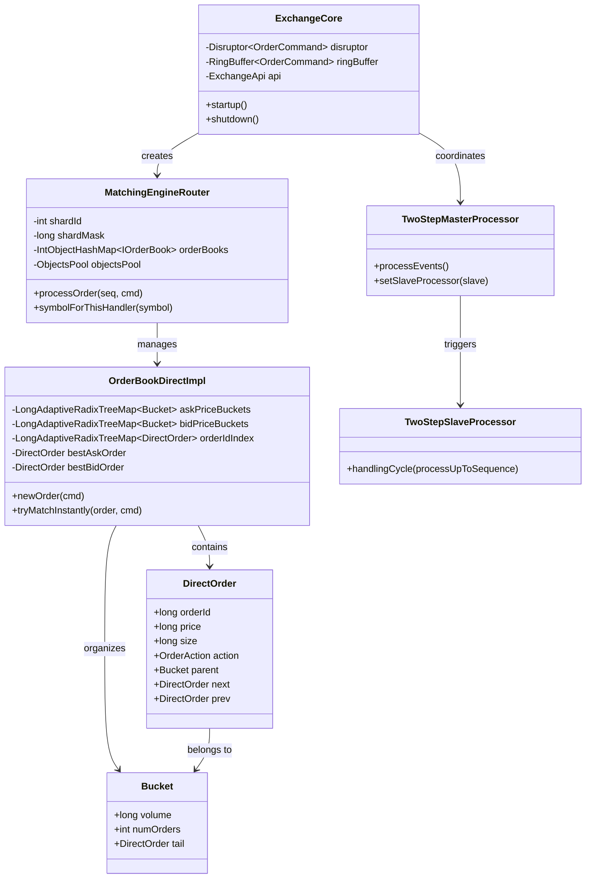
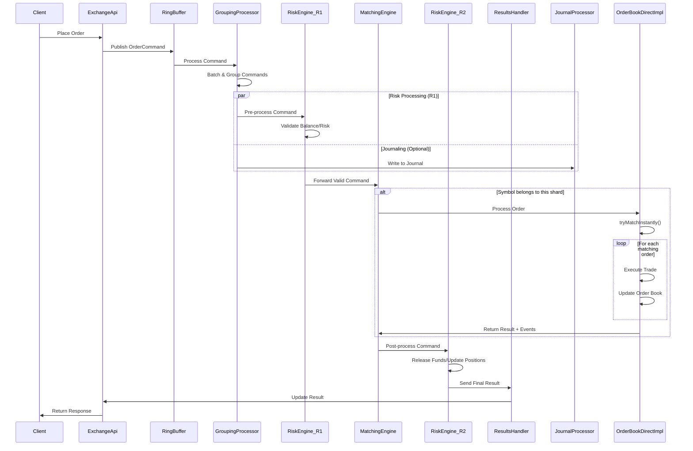

## Exchange Core 거래소 프로그램 분석

### 1. 시스템 아키텍처 개요

이 거래소는 **LMAX Disruptor** 패턴을 기반으로 한 고성능 거래 시스템입니다. 주요 특징:

- **Pipelined Multi-Core Processing**: CPU 코어별로 특정 처리 단계를 담당
- **Sharding**: 심볼별로 Order Book을 분산 처리
- **Lock-Free**: 메모리 장벽과 CAS 연산을 활용한 무잠금 동시성
- **Object Pooling**: 가비지 컬렉션 최소화를 위한 객체 재사용

### 2. 핵심 구성 요소

#### 2.1 ExchangeCore - 메인 컨트롤러
```java
public final class ExchangeCore {
    private final Disruptor<OrderCommand> disruptor;
    private final RingBuffer<OrderCommand> ringBuffer;
    private final ExchangeApi api;
}
```

#### 2.2 처리 파이프라인
1. **GroupingProcessor (G)**: 명령 그룹화 및 배치 처리
2. **Risk Engine (R1)**: 위험 관리 및 잔고 검증 (사전 처리)
3. **Matching Engine (ME)**: 주문 매칭 엔진
4. **Risk Engine (R2)**: 위험 관리 후처리
5. **Results Handler (E)**: 결과 처리

### 3. Order Book 구조

#### 3.1 OrderBookDirectImpl - 고성능 구현체

**핵심 자료구조:**
```java
public final class OrderBookDirectImpl implements IOrderBook {
    // 가격별 버킷 (Adaptive Radix Tree)
    private final LongAdaptiveRadixTreeMap<Bucket> askPriceBuckets;
    private final LongAdaptiveRadixTreeMap<Bucket> bidPriceBuckets;
    
    // 주문 ID 인덱스
    private final LongAdaptiveRadixTreeMap<DirectOrder> orderIdIndex;
    
    // 최적 가격 주문 포인터
    private DirectOrder bestAskOrder = null;
    private DirectOrder bestBidOrder = null;
}
```

**DirectOrder 연결 리스트 구조:**
```java
public static final class DirectOrder implements IOrder {
    Bucket parent;           // 소속 가격 버킷
    DirectOrder next;        // 다음 주문 (매칭 방향)
    DirectOrder prev;        // 이전 주문 (큐 tail 방향)
}
```

#### 3.2 주문 매칭 알고리즘

**즉시 매칭 로직 (`tryMatchInstantly`)**:
```12:336:src/main/java/exchange/core2/core/orderbook/OrderBookDirectImpl.java
private long tryMatchInstantly(final IOrder takerOrder,
                               final OrderCommand triggerCmd) {
    
    final boolean isBidAction = takerOrder.getAction() == OrderAction.BID;
    DirectOrder makerOrder = isBidAction ? bestAskOrder : bestBidOrder;
    
    // 가격 조건 확인
    if (makerOrder == null || 
        (isBidAction && makerOrder.price > limitPrice) ||
        (!isBidAction && makerOrder.price < limitPrice)) {
        return takerOrder.getFilled();
    }
    
    // 주문 매칭 루프
    do {
        final long tradeSize = Math.min(remainingSize, 
                                      makerOrder.size - makerOrder.filled);
        
        // 거래 실행
        makerOrder.filled += tradeSize;
        makerOrder.parent.volume -= tradeSize;
        remainingSize -= tradeSize;
        
        // 완전 체결된 주문 제거
        if (makerOrder.size == makerOrder.filled) {
            orderIdIndex.remove(makerOrder.orderId);
            objectsPool.put(ObjectsPool.DIRECT_ORDER, makerOrder);
        }
        
        makerOrder = makerOrder.prev; // 다음 주문으로 이동
        
    } while (makerOrder != null && remainingSize > 0);
}
```

### 4. 쓰레드별 Order Book 분산 처리

#### 4.1 Sharding 메커니즘
```233:235:src/main/java/exchange/core2/core/processors/MatchingEngineRouter.java
private boolean symbolForThisHandler(final long symbol) {
    return (shardMask == 0) || ((symbol & shardMask) == shardId);
}
```

- **Shard Count**: 2의 거듭제곱으로 제한 (비트 마스킹 최적화)
- **Symbol-based Sharding**: 심볼 ID를 기준으로 해시 분산
- **Thread Affinity**: 각 매칭 엔진이 특정 CPU 코어에 고정

#### 4.2 매칭 엔진 라우터 초기화
```84:102:src/main/java/exchange/core2/core/processors/MatchingEngineRouter.java
public MatchingEngineRouter(final int shardId,
                            final long numShards, ...) {
    
    if (Long.bitCount(numShards) != 1) {
        throw new IllegalArgumentException("Invalid number of shards " + numShards 
                                         + " - must be power of 2");
    }
    
    this.shardId = shardId;
    this.shardMask = numShards - 1;  // 비트 마스크 생성
    
    // 객체 풀 초기화
    objectsPoolConfig.put(ObjectsPool.DIRECT_ORDER, 1024 * 1024);
    objectsPoolConfig.put(ObjectsPool.DIRECT_BUCKET, 1024 * 64);
}
```

### 5. 클래스 다이어그램



### 6. 시퀀스 다이어그램 - 주문 처리 플로우



### 7. 저지연 처리를 위한 최적화 기술

#### 7.1 메모리 최적화
- **Object Pooling**: DirectOrder, Bucket 객체 재사용
- **LongAdaptiveRadixTreeMap**: 캐시 친화적인 ART 자료구조
- **Pre-allocated Arrays**: L2 Market Data용 배열 사전 할당

#### 7.2 CPU 최적화
- **Thread Affinity**: 각 프로세서를 특정 CPU 코어에 고정
- **NUMA-aware**: CPU 소켓별 메모리 접근 최적화
- **Busy Spinning**: 컨텍스트 스위칭 최소화

#### 7.3 알고리즘 최적화
- **Price-Time Priority**: 연결 리스트로 O(1) 주문 삽입/삭제
- **Best Price Tracking**: bestAskOrder/bestBidOrder 포인터로 O(1) 최적가 접근
- **Batch Processing**: 명령 그룹화로 처리량 향상

### 8. 성능 구성 옵션

```130:163:src/main/java/exchange/core2/core/common/config/PerformanceConfiguration.java
public static PerformanceConfiguration.PerformanceConfigurationBuilder latencyPerformanceBuilder() {
    return builder()
            .ringBufferSize(2 * 1024)        // 작은 링버퍼로 지연시간 최소화
            .matchingEnginesNum(1)           // 단일 매칭 엔진
            .msgsInGroupLimit(256)           // 작은 배치 크기
            .maxGroupDurationNs(10_000)      // 10μs 최대 그룹 지속시간
            .waitStrategy(CoreWaitStrategy.BUSY_SPIN); // Busy spin 대기
}

public static PerformanceConfiguration.PerformanceConfigurationBuilder throughputPerformanceBuilder() {
    return builder()
            .ringBufferSize(64 * 1024)       // 큰 링버퍼로 처리량 향상
            .matchingEnginesNum(4)           // 다중 매칭 엔진
            .msgsInGroupLimit(4_096)         // 큰 배치 크기
            .maxGroupDurationNs(4_000_000);  // 4ms 최대 그룹 지속시간
}
```

이 거래소는 금융 시장의 엄격한 성능 요구사항을 만족하기 위해 하드웨어부터 알고리즘까지 모든 레벨에서 최적화된 아키텍처를 구현했습니다. 특히 심볼별 샤딩과 쓰레드 어피니티를 통해 확장성과 저지연을 동시에 달성한 것이 핵심 특징입니다.


# 📖 **OrderBook 모듈 상세 분석**

exchange-core2의 orderbook 패키지는 **고성능 주문장 매칭 엔진**의 핵심 구현체들을 포함합니다. 각 클래스의 역할과 동작을 상세히 설명드리겠습니다.

## 🏗️ **1. IOrderBook 인터페이스**

### **핵심 메서드들**
```java
public interface IOrderBook extends WriteBytesMarshallable, StateHash {
    void newOrder(OrderCommand cmd);           // 새 주문 처리
    CommandResultCode cancelOrder(OrderCommand cmd);  // 주문 취소
    CommandResultCode reduceOrder(OrderCommand cmd);  // 주문 수량 감소
    CommandResultCode moveOrder(OrderCommand cmd);    // 주문 가격 변경
    
    // 시장 데이터 조회
    L2MarketData getL2MarketDataSnapshot(int size);
    Stream<? extends IOrder> askOrdersStream(boolean sorted);
    Stream<? extends IOrder> bidOrdersStream(boolean sorted);
}
```

### **구현체 타입**
```java
enum OrderBookImplType {
    NAIVE(0),    // 단순 구현체 (TreeMap 기반)
    DIRECT(2);   // 고성능 구현체 (ART + 연결리스트)
}
```

## 🚀 **2. OrderBookDirectImpl - 고성능 구현체**

### **핵심 데이터 구조**
```java
public final class OrderBookDirectImpl implements IOrderBook {
    // 가격별 주문 버킷 (Adaptive Radix Tree)
    private final LongAdaptiveRadixTreeMap<Bucket> askPriceBuckets;
    private final LongAdaptiveRadixTreeMap<Bucket> bidPriceBuckets;
    
    // 주문 ID 인덱스
    private final LongAdaptiveRadixTreeMap<DirectOrder> orderIdIndex;
    
    // 최적 주문 참조 (빠른 매칭을 위해)
    private DirectOrder bestAskOrder = null;  // 최저 매도가
    private DirectOrder bestBidOrder = null;  // 최고 매수가
    
    // 객체 풀 (GC 최소화)
    private final ObjectsPool objectsPool;
}
```

### **DirectOrder - 연결리스트 기반 주문**
```java
public static final class DirectOrder implements IOrder {
    // 주문 정보
    public long orderId, price, size, filled;
    public OrderAction action;
    public long uid, timestamp;
    
    // 연결리스트 구조 (시간 우선순위)
    Bucket parent;      // 소속 가격 버킷
    DirectOrder next;   // 다음 주문 (매칭 방향)
    DirectOrder prev;   // 이전 주문 (큐 끝 방향)
}
```

### **Bucket - 가격별 주문 그룹**
```java
private static class Bucket {
    long volume;         // 총 주문량
    int numOrders;       // 주문 개수
    DirectOrder tail;    // 해당 가격의 마지막 주문
}
```

### **주요 동작 원리**

#### **🔄 주문 매칭 로직**
```java
private long tryMatchInstantly(IOrder takerOrder, OrderCommand triggerCmd) {
    boolean isBidAction = takerOrder.getAction() == OrderAction.BID;
    DirectOrder makerOrder = isBidAction ? bestAskOrder : bestBidOrder;
    
    // 가격 조건 확인
    if (makerOrder == null || 
        (isBidAction ? makerOrder.price > limitPrice : makerOrder.price < limitPrice)) {
        return takerOrder.getFilled();
    }
    
    // 매칭 루프
    do {
        long tradeSize = Math.min(remainingSize, makerOrder.size - makerOrder.filled);
        
        // 주문 체결 처리
        makerOrder.filled += tradeSize;
        makerOrder.parent.volume -= tradeSize;
        remainingSize -= tradeSize;
        
        // 완전 체결된 주문 제거
        if (makerOrder.size == makerOrder.filled) {
            orderIdIndex.remove(makerOrder.orderId);
            objectsPool.put(ObjectsPool.DIRECT_ORDER, makerOrder);
        }
        
        makerOrder = makerOrder.prev; // 다음 주문으로
        
    } while (makerOrder != null && remainingSize > 0);
}
```

#### **📝 주문 삽입 로직**
```java
private void insertOrder(DirectOrder order, Bucket freeBucket) {
    LongAdaptiveRadixTreeMap<Bucket> buckets = 
        order.action == OrderAction.ASK ? askPriceBuckets : bidPriceBuckets;
    
    Bucket toBucket = buckets.get(order.price);
    
    if (toBucket != null) {
        // 기존 버킷에 추가 (시간 우선순위 유지)
        DirectOrder oldTail = toBucket.tail;
        DirectOrder prevOrder = oldTail.prev;
        
        // 연결리스트 업데이트
        toBucket.tail = order;
        oldTail.prev = order;
        order.next = oldTail;
        order.prev = prevOrder;
        order.parent = toBucket;
        
    } else {
        // 새 버킷 생성
        Bucket newBucket = freeBucket != null ? freeBucket : 
            objectsPool.get(ObjectsPool.DIRECT_BUCKET, Bucket::new);
        
        newBucket.tail = order;
        newBucket.volume = order.size - order.filled;
        buckets.put(order.price, newBucket);
        
        // bestOrder 업데이트
        if (order.action == OrderAction.ASK) {
            bestAskOrder = order;
        } else {
            bestBidOrder = order;
        }
    }
}
```

## 🌳 **3. OrderBookNaiveImpl - 단순 구현체**

### **데이터 구조**
```java
public final class OrderBookNaiveImpl implements IOrderBook {
    // TreeMap 기반 (자동 정렬)
    private final NavigableMap<Long, OrdersBucketNaive> askBuckets;
    private final NavigableMap<Long, OrdersBucketNaive> bidBuckets;
    
    // 주문 ID 인덱스
    private final LongObjectHashMap<Order> idMap;
}
```

### **특징**
- **TreeMap** 사용으로 구현이 간단
- **자동 정렬**되지만 성능이 DirectImpl보다 낮음
- **테스트 및 검증용**으로 주로 사용

## 🗂️ **4. OrdersBucketNaive - 가격별 주문 컨테이너**

### **구조**
```java
public final class OrdersBucketNaive {
    private final long price;                           // 가격
    private final LinkedHashMap<Long, Order> entries;   // 주문들 (FIFO)
    private long totalVolume;                           // 총 물량
}
```

### **매칭 로직**
```java
public MatcherResult match(long volumeToCollect, IOrder activeOrder, 
                          OrderBookEventsHelper helper) {
    Iterator<Map.Entry<Long, Order>> iterator = entries.entrySet().iterator();
    
    while (iterator.hasNext() && volumeToCollect > 0) {
        Order order = iterator.next().getValue();
        
        // 체결 가능한 수량 계산
        long v = Math.min(volumeToCollect, order.size - order.filled);
        
        // 주문 업데이트
        order.filled += v;
        volumeToCollect -= v;
        totalVolume -= v;
        
        // 완전 체결시 제거
        if (order.size == order.filled) {
            iterator.remove();
        }
        
        // 거래 이벤트 생성
        MatcherTradeEvent tradeEvent = helper.sendTradeEvent(order, ...);
    }
}
```

## ⚡ **5. OrderBookEventsHelper - 이벤트 관리자**

### **주요 기능**
```java
public final class OrderBookEventsHelper {
    // 거래 이벤트 생성
    public MatcherTradeEvent sendTradeEvent(IOrder matchingOrder, 
                                           boolean makerCompleted,
                                           boolean takerCompleted, 
                                           long size, 
                                           long bidderHoldPrice);
    
    // 주문 감소 이벤트
    public MatcherTradeEvent sendReduceEvent(IOrder order, 
                                            long reduceSize, 
                                            boolean completed);
    
    // 주문 거부 이벤트
    public void attachRejectEvent(OrderCommand cmd, long rejectedSize);
}
```

### **이벤트 체인**
- **연결리스트 구조**로 여러 이벤트를 체인으로 연결
- **메모리 풀링**으로 GC 압박 최소화
- **직렬화 지원**으로 영속성 보장

## 🔄 **6. OrdersSpliterator - 스트림 지원**

```java
public final class OrdersSpliterator implements Spliterator<DirectOrder> {
    private DirectOrder pointer;
    
    @Override
    public boolean tryAdvance(Consumer<? super DirectOrder> action) {
        if (pointer == null) return false;
        
        action.accept(pointer);
        pointer = pointer.prev;  // 연결리스트 순회
        return true;
    }
}
```

## 🎯 **성능 최적화 특징**

### **1. 메모리 효율성**
- **객체 풀링**: GC 압박 최소화
- **연결리스트**: 동적 크기 조정
- **ART 구조**: 메모리 효율적인 인덱싱

### **2. 시간 복잡도**
- **주문 삽입**: O(log n) - ART 접근
- **주문 매칭**: O(1) - bestOrder 직접 접근
- **주문 취소**: O(log n) - 인덱스 조회

### **3. 동시성 고려**
- **단일 스레드** 설계 (Disruptor 패턴과 함께 사용)
- **락프리** 구조
- **상태 일관성** 보장

## 📊 **주문 타입별 처리**

### **GTC (Good Till Cancel)**
```java
private void newOrderPlaceGtc(OrderCommand cmd) {
    // 1. 즉시 매칭 시도
    long filledSize = tryMatchInstantly(cmd, cmd);
    
    // 2. 미체결 부분을 주문장에 등록
    if (filledSize < cmd.size) {
        DirectOrder orderRecord = objectsPool.get(...);
        // ... 주문 정보 설정
        orderIdIndex.put(orderId, orderRecord);
        insertOrder(orderRecord, null);
    }
}
```

### **IOC (Immediate or Cancel)**
```java
private void newOrderMatchIoc(OrderCommand cmd) {
    // 즉시 매칭만 시도, 미체결 부분은 거부
    long filledSize = tryMatchInstantly(cmd, cmd);
    long rejectedSize = cmd.size - filledSize;
    
    if (rejectedSize != 0) {
        eventsHelper.attachRejectEvent(cmd, rejectedSize);
    }
}
```

### **FOK_BUDGET (Fill or Kill with Budget)**
```java
private void newOrderMatchFokBudget(OrderCommand cmd) {
    // 예산 한도 내에서 전량 체결 가능한지 확인
    long budget = checkBudgetToFill(cmd.action, cmd.size);
    
    if (isBudgetLimitSatisfied(cmd.action, budget, cmd.price)) {
        tryMatchInstantly(cmd, cmd);  // 전량 체결
    } else {
        eventsHelper.attachRejectEvent(cmd, cmd.size);  // 전량 거부
    }
}
```

이 orderbook 모듈은 **마이크로초 단위의 초저지연**과 **초당 수백만 건의 처리량**을 목표로 설계된 **프로덕션 레벨의 고성능 매칭 엔진**입니다.


